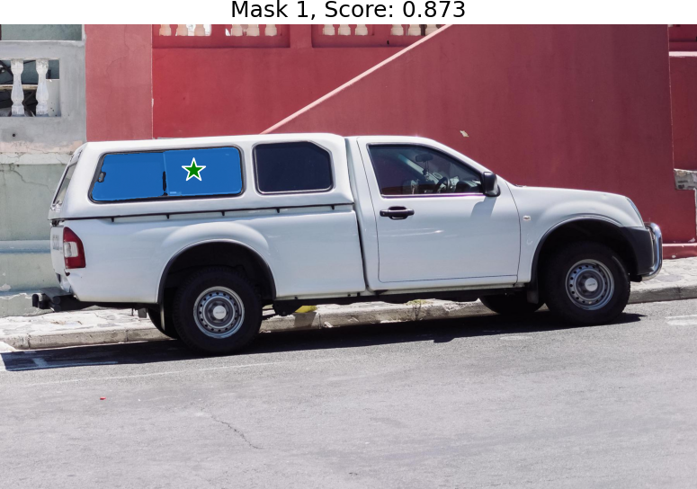

<div align="center">


# sam-hq-tensorrt

[](https://www.python.org/downloads/release/python-388/)
[](https://developer.nvidia.com/cuda-11-8-0-download-archive)
[](https://developer.nvidia.com/tensorrt)

*: This repository is just for onnx2tensorrt of Depth Anything v2.
</div>

## Requirments

* python 3.8.8
* cuda 11.8
* tensorrt 8.6.1

*: About tensorrt, you can download it from [NVIDIA TensorRT](https://developer.nvidia.com/nvidia-tensorrt-8x-download), and then you can install it by the following command.


```shell
export LD_LIBRARY_PATH=/path/to/TensorRT-8.6.1.6/lib:$LD_LIBRARY_PATH
export PATH=$PATH:/path/to/TensorRT-8.6.1.6/bin
source ~/.bashrc
source /etc/profile

cd TensorRT-8.6.1.6/python
pip install tensorrt-8.6.1-cp38-none-linux_x86_64.whl

cd TensorRT-8.6.1.6/graphsurgeon
pip install graphsurgeon-0.4.6-py2.py3-none-any.whl

cd TensorRT-8.6.1.6/onnx_graphsurgeon
pip install onnx_graphsurgeon-0.3.12-py2.py3-none-any.whl
```


## Usage

Firstly, you can download the corresponding `pth` model file into the checkpoints folder from [sam-hq](https://drive.google.com/file/d/11yExZLOve38kRZPfRx_MRxfIAKmfMY47/view?usp=sharing).

Next, You can convert `pth` model to `onnx` file for using the corresponding command. (Here is an example for `sam_hq_vit_b.pth`, if you want to use other model, you can change the model name in the command)

*: The workspace is the maximum memory size that `TensorRT` can allocate for building an engine. The larger the workspace, the more memory `TensorRT` can use to optimize the engine, and the faster the inference speed will be. However, the larger the workspace, the more memory will be used, so you need to choose a suitable workspace size according to your own hardware configuration.

- Transform image embedding `pth` model to `onnx` engine


```bash
python scripts/export_onnx_embed.py --img_pt2onnx --sam_checkpoint pretrained_checkpoint/sam_hq_vit_b.pth --model_type vit_b
```

+ Transform image embedding onnx model to tensorrt engine

```shell
python scripts/export_onnx_embed.py --img_onnx2trt --img_onnx_model_path embedding_onnx/sam_vit_b_embedding.onnx
```

- Transform sam pth model to onnx model

```shell
python scripts/export_onnx_embed.py --prompt_masks_pt2onnx --model_type vit_b --sam_checkpoint pretrained_checkpoint/sam_hq_vit_b.pth
```

- Transform sam onnx model to engine model

```shell
python scripts/export_onnx_embed.py --sam_onnx2trt --sam_onnx_path ./pretrained_checkpoint/sam_hq_vit_b.onnx
```

Finally, you can infer the image with the engine file.

```bash
python trt_infer.py --img_path assets/truck.jpg --sam_engine_file pretrained_checkpoint/sam_hq_vit_b.engine --embedding_engine_file embedding_onnx/sam_vit_b_embedding.engine --batch_size 1
```

When you run the command, you will see the following output:


* The output would be a image with the depth map.

## 👏 Acknowledgement

This project is based on the following projects:

- [sam-hq](https://github.com/SysCV/sam-hq?tab=readme-ov-file) - Segment Anything in High Quality.
- [TensorRT](https://github.com/NVIDIA/TensorRT/tree/release/8.6/samples) - TensorRT samples and api documentation.
- [Segment anything tensorrt](https://github.com/BooHwang/segment_anything_tensorrt) - Segment anything tensorrt.